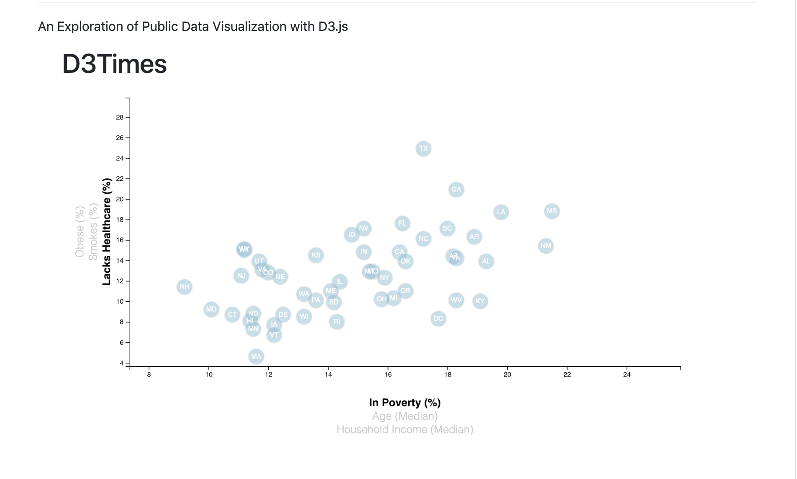

### An Exploration of Public Data Visualization with D3.js

This project uses D3.js to visualize some state-level data about population health based on 2014 U.S Census data. It similates an on-line newpaper article with an interactive visualization. Three risk factors (obesity, smoking, and uninsurance rates) are plotted against three perhaps underlying factors (income, poverty rate, and age).

## Running the visualization:

Due to loading in a csv file, many browsers will fail to load this unless it is running on an http server. This project was developed to run with the visual Studion Code live Server.
